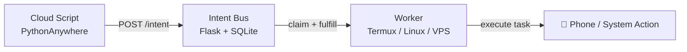

# Intent Bus

[](https://badge.fury.io/py/intent-bus)
[](https://opensource.org/licenses/MIT)

> **Run code on any device from anywhere — using just HTTP.**

A zero-infrastructure job coordination system with retries, atomic locking, priority scheduling, and cross-device workers.
Built for developers who want something more reliable than cron, without the overhead of Redis, RabbitMQ, or Firebase.

📖 [Why I built this](https://dev.to/d_security/why-i-built-a-job-queue-with-sqlite-instead-of-redis-and-what-i-learned-4f05) · 📱 [Cross-device automation guide](https://dev.to/d_security/how-i-coordinate-scripts-across-devices-without-open-ports-firebase-or-a-vps-1ipi)

---

## What makes this different?

- Trigger your **Android phone from a cloud server**
- Run jobs across devices **without opening ports**
- Build distributed systems using **just HTTP + curl**
- **Priority Queues** — high-priority intents are always claimed first
- **Capability Routing** — workers advertise what they can do; jobs require what they need
- **Dead-Letter Queue** — failed jobs are archived, not lost
- No external brokers or managed queue infrastructure required

No external brokers. Just a minimal Flask + SQLite core.

---

## How it works (30 seconds)

1. A client **POSTs a job** to `/intent`
2. Workers **poll `/claim`** for matching jobs
3. One worker **atomically claims** the job (`BEGIN IMMEDIATE` + `UPDATE ... RETURNING`)
4. Worker executes and calls `/fulfill`
5. If it crashes, the job is **requeued with exponential backoff** and retried up to `max_attempts` times before being archived to the **dead-letter queue**

Claims are lease-based and automatically expire if a worker disappears before fulfillment.




---

## Why not just use X?

| Tool | Problem |
|------|---------|
| **Cron** | No coordination, no retries, silent failures |
| **Redis / Celery** | Requires running and maintaining a server |
| **RabbitMQ** | Heavy infra, steep learning curve |
| **Firebase** | Vendor lock-in, SDK bloat, pricing at scale |
| **Intent Bus** | ✅ Single file, deploy anywhere, zero ops |

---

## Who is this for?

- Developers running scripts across multiple machines
- People using **Termux / Android automation**
- Indie hackers avoiding infrastructure complexity
- Anyone who wants job queues without Redis or RabbitMQ

This project is designed for low-to-medium traffic workloads.
Hundreds to low thousands of jobs per minute are achievable depending on workload characteristics and hardware.

---

## Authentication

Intent Bus supports two auth modes for regular clients and a separate admin auth layer.

### Standard Auth

```text
X-API-KEY: your_key_here
```

Works with curl, bash scripts, and IoT devices. No replay protection.

### Strict Auth (Recommended for production)

- HMAC-SHA256 signed requests
- Nonce-based replay protection
- Canonical request serialization
- Handled automatically by the Python SDK

Enable globally with `BUS_REQUIRE_SIGNATURES=true`, or let clients opt in by including signature headers.

### Admin Auth

Admin endpoints (`/admin/*`) use a separate privileged credential:

- `X-Admin-Token: <BUS_ADMIN_SECRET>` header, or
- HTTP Basic auth (`admin` / `DASHBOARD_PASSWORD`)

> ⚠️ **`BUS_ADMIN_SECRET` or HTTP Basic Auth is strictly required for admin access.**

---

## Quickstart (CLI)

The Python SDK ships with a production-ready CLI for terminal interaction.

```bash
pip install intent-bus
export INTENT_API_KEY="your_key_here"
```

**Publish a job:**
```bash
intent-bus publish send_notification '{"instruction": "Hello"}' -n default
```

**Run a worker from the terminal:**
```bash
intent-bus listen send_notification -n default -c notify
```

---

## Quickstart (Python SDK)

```bash
pip install intent-bus
```

### Publish a job

`publish()` returns an `IntentStatus` model.

```python
from intent_bus import IntentClient

# Use as a context manager for automatic connection pooling cleanup
with IntentClient(api_key="your_key_here") as client:
    published = client.publish(
        goal="send_notification",
        payload={"instruction": "Hello from the cloud"},
        idempotency_key="task_123",  # Prevents double-execution on retry
        priority=500,               # Higher = claimed first (0–1000, default 100)
    )
    print(f"Published: {published.id}")
```

**Job Visibility:**
- `private` *(default)* — only workers using the same API key as the publisher can claim this job
- `public` — any authenticated worker in the same namespace can claim this job

> ⚠️ **Public jobs can be claimed by any authenticated worker in the namespace.**
> Do not use `visibility="public"` for sensitive workloads unless every worker on your bus is trusted.

**Priority:** Higher numbers are claimed first. Default is 100. Range is 0–1000.

### Run a worker

`claim()` returns a `ClaimResponse[ClaimedIntent]`. Use `job.id` and `job.payload` in handlers.

```python
from intent_bus import IntentClient, WorkerRuntime

def handler(payload):
    # payload is the dict passed to publish()
    print("Received:", payload.get("instruction"))

    # Return a dict for fulfillment; the SDK handles the /fulfill call
    return {"result": "delivered", "result_type": "text"}

client = IntentClient(api_key="your_key_here")
runtime = WorkerRuntime(client=client)

# Resilient v2.0 loop with exponential backoff and jitter
runtime.listen(goal="send_notification", handler=handler)
```

> ⚠️ **Workers must be idempotent.**
> The same job may be delivered more than once if:
>
> - the worker crashes mid-execution
> - the lease expires before `/fulfill` is called
> - the network drops after the server marks the job fulfilled but before the response arrives
> - the bus retries due to an ambiguous failure

**SDK repo:** https://github.com/dsecurity49/Intent-Bus-sdk

---

## Quickstart (curl / Bash)

### Publish a job

```bash
curl -X POST https://dsecurity.pythonanywhere.com/intent \
  -H "Content-Type: application/json" \
  -H "X-API-KEY: your_key_here" \
  -d '{"goal":"send_notification","payload":{"instruction":"Hello"}}'
```

### Publish with priority and delay

```bash
curl -X POST https://dsecurity.pythonanywhere.com/intent \
  -H "Content-Type: application/json" \
  -H "X-API-KEY: your_key_here" \
  -d '{"goal":"send_notification","payload":{"instruction":"Urgent"},"priority":900,"delay":5.0}'
```

### Claim and fulfill

```bash
# Claim (returns a JSON intent model in v2.0)
curl -s -X POST "https://dsecurity.pythonanywhere.com/claim?goal=send_notification" \
  -H "X-API-KEY: your_key_here"

# Fulfill (v2.0 requires result_type)
curl -s -X POST "https://dsecurity.pythonanywhere.com/fulfill/<INTENT_ID>" \
  -H "Content-Type: application/json" \
  -H "X-API-KEY: your_key_here" \
  -d '{"result":"done","result_type":"text"}'
```

If a job isn't fulfilled within 60 seconds, it is automatically requeued with exponential backoff.

> **Worker polling:** After a `204 No Content` (no jobs available), workers SHOULD wait for the `Retry-After` duration (default 1s).
> Tight polling loops create unnecessary write pressure on SQLite under concurrency.

---

## Job Lifecycle

```text
open ──► claimed ──► fulfilled
                │
                ▼
              open  (retry with backoff, if attempts remain)
                │
                ▼  (after max_attempts exhausted)
              dead ──► dead-letter queue
```

Dead letters can be inspected at `/admin/dead` and retried via `/admin/intents/<id>/retry`.

---

## Smart Routing

Two routing primitives that go beyond simple goal matching.

### Target a specific worker

Send a job directly to one named machine — useful when a task must run on a particular device (a phone, a GPU node, a Pi with attached hardware).

```python
client.publish(
    goal="run_backup",
    payload={"instruction": "/data"},
    target_worker="termux-phone-1",   # only this worker can claim it
)
```

The worker declares its ID at claim time:

```bash
curl -X POST "https://dsecurity.pythonanywhere.com/claim?goal=run_backup" \
  -H "X-API-KEY: key" \
  -H "X-Worker-ID: termux-phone-1"
```

### Require a capability

Route jobs to any worker that advertises the right capability — useful when you have a mixed fleet and only some workers can handle a given task.

```python
client.publish(
    goal="transcribe_audio",
    payload={"instruction": "meeting.mp3"},
    required_capability="whisper",
)
```

Workers declare their capabilities at claim time:

```bash
curl -X POST "https://dsecurity.pythonanywhere.com/claim" \
  -H "X-API-KEY: key" \
  -H "X-Worker-Capabilities: whisper,ffmpeg,gpu"
```

Both fields can be combined.
A job with `target_worker` and `required_capability` must satisfy both conditions before any worker can claim it.

---

## Example Use Cases

- Trigger a **phone notification** when a cloud scraper finishes
- Deploy to a **Raspberry Pi behind a firewall** without opening ports
- Relay alerts to **Discord** from any script
- Replace fragile cron pipelines with loosely coupled workers
- Coordinate a **heterogeneous worker fleet** using capability matching

---

## Features

- **Reliable Delivery** — jobs retried with exponential backoff up to `max_attempts`
- **Atomic Locking** — `BEGIN IMMEDIATE` + `RETURNING` prevents double-claiming
- **Dead-Letter Queue** — exhausted jobs archived for inspection and one-click retry
- **Priority Scheduling** — higher-priority intents always claimed before lower ones
- **Namespace Isolation** — partition workloads across logical domains
- **Worker Targeting** — route a job directly to a named worker
- **Capability Matching** — require specific capabilities for specialized tasks
- **Delayed Execution** — publish now, make claimable later with `delay`
- **Result Storage** — workers store structured results (`json` / `text`); publishers poll `/result/<id>`
- **Idempotency Keys** — safe publisher retries with no duplicate jobs
- **Hybrid Visibility** — private by default, optionally open to the whole namespace
- **Rate Limiting** — 60 req/min per API key
- **Ephemeral KV Store** — `/set` and `/get` with configurable TTL
- **Lazy Cleanup** — triggered by traffic, no background thread required
- **Structured Observability** — Whitelist-filtered JSON logging, `duration_ms` tracking, and `X-Request-ID` tracing
- **HMAC Signing** — optional replay-protected auth, handled by v2.0 SDK
- **Admin Dashboard** — live queue stats and management at `/admin/dashboard`
- **Prometheus Metrics** — `/metrics` with intent counts by status and namespace

---

## Architecture Guarantees

- Jobs are not silently discarded during normal queue operation
- Only **one worker** can claim a job at a time
- Workers can **crash safely** — jobs are requeued after lease expiry
- Delivery is **at-least-once** — design workers to be idempotent
- Dead intents are **archived**, not deleted

---

## ⚠️ Limitations

- SQLite has **single-writer contention** under high concurrency
- Best for **hundreds to low thousands of jobs per minute** with dozens of workers
- Not a replacement for Kafka or RabbitMQ at scale
- Upgrade path: swap SQLite for PostgreSQL — the change is isolated to `get_db()`

---

## Setup

### Option 1 — PythonAnywhere (Free tier)

**Requirement:** SQLite 3.35.0+ (for the atomic `RETURNING` clause)

```bash
python -c "import sqlite3; print(sqlite3.sqlite_version)"
```

```bash
git clone https://github.com/dsecurity49/Intent-Bus.git
cd Intent-Bus
pip install -r server-requirements.txt
```

### Option 2 — Docker

```bash
git clone https://github.com/dsecurity49/Intent-Bus.git
cd Intent-Bus
mkdir -p bus_data && chmod 755 bus_data
docker-compose up -d
```

---

## Environment Variables

| Variable | Default | Description |
|----------|---------|-------------|
| `BUS_SECRET` | — | Main API key. **Required in production.** |
| `BUS_ADMIN_SECRET` | — | Admin token. |
| `DASHBOARD_PASSWORD` | — | Basic auth password for the admin dashboard. |
| `BUS_DB_PATH` | `infrastructure.db` | Path to the SQLite database file. |
| `BUS_REQUIRE_SIGNATURES` | `false` | Require HMAC signing on all client requests. |
| `BUS_CLEANUP_INTERVAL_SECONDS` | `21600` | Seconds between automatic cleanup passes. |

---

## API Reference

| Method | Endpoint | Auth | Description |
|--------|----------|------|-------------|
| `POST` | `/intent` | API key | Publish a job |
| `POST` | `/claim` | API key | Claim a job |
| `POST` | `/fulfill/<id>` | API key | Mark job complete (v2.0 requires `result_type`) |
| `POST` | `/fail/<id>` | API key | Fail a job (triggers retry or dead-lettering) |
| `GET` | `/result/<id>` | API key | Get stored result and full status |
| `POST` | `/set/<key>` | API key | Set a KV store entry with TTL |
| `GET` | `/get/<key>` | API key | Get a KV store entry |
| `POST` | `/admin/cleanup` | Admin | Run cleanup manually and return stats |

---

## Why I built this

I wanted to trigger scripts on my Android phone from a cloud server — without Firebase, open ports, or complex infrastructure.
So I built a tiny job bus using Flask + SQLite.
It worked. Then I kept going.

---

## Contributors & Acknowledgements

- **Zan (@ghostframe)** — Security auditing, responsible disclosure, and hardening patches for v7.6.
- **Dhanush (@dsecurity49)** — Creator and lead maintainer.

Interested in contributing? See [CONTRIBUTING.md](CONTRIBUTING.md).

---

## License

MIT
